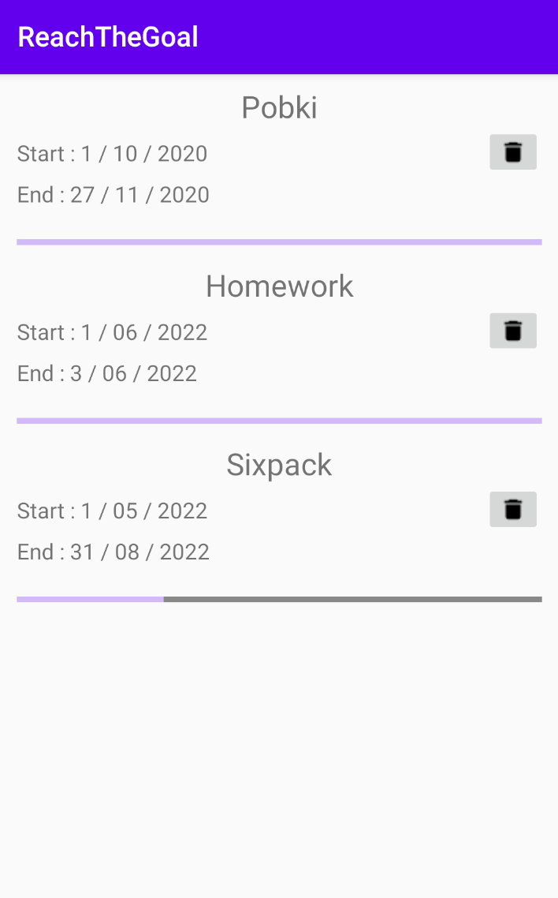
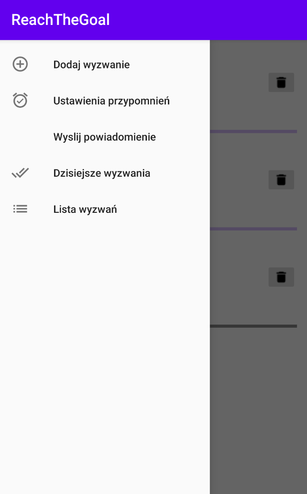
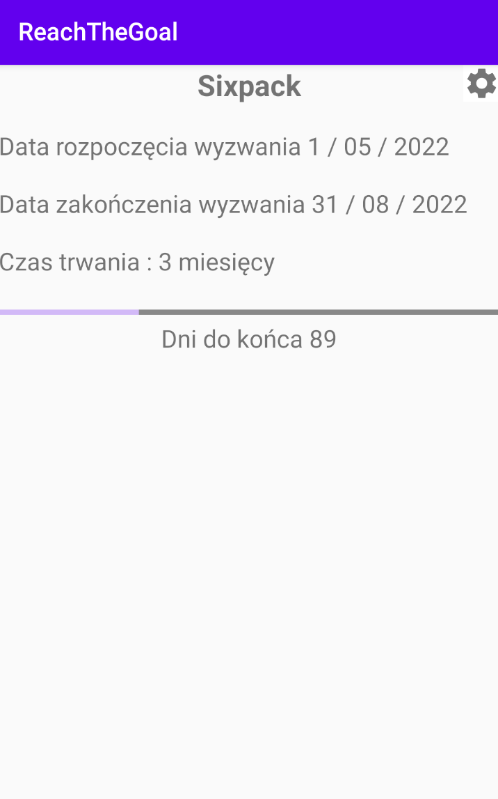
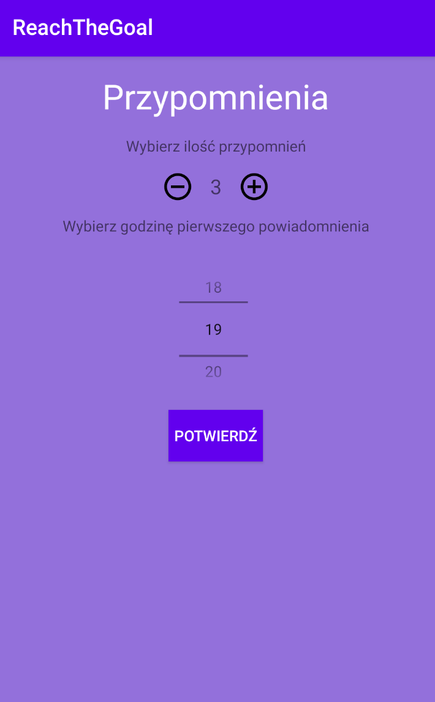

<h1 align="center">✔️ReachTheGoal❌</h1>

  

## Project Overview 🎉
Simple application to help you to  achieve all your goals.
Swipe right on main screen to see a menu with options such as notifications, new goal or a daily check list with your goals.
## Tech/framework used 🔧

| Tech                                                    |
| ------------------------------------------------------- | 
| [Room](https://developer.android.com/training/data-storage/room)                           
| [MVVM](https://developer.android.com/topic/libraries/architecture/viewmodel)                          

## Screenshots 📺

    

   

   

## Features ⭐
✔️ Daily checklist   
✔️ Days and months counter  
✔️ ProgressBar  
✔️ Notifications  
✔️ Goals list  

<h2> A word from the author 💬 </h2>
 
 I finished working on the application when I achieved all the goals I set myself before starting the project.
 Therefore, the application is not complete and brought to the very end.
